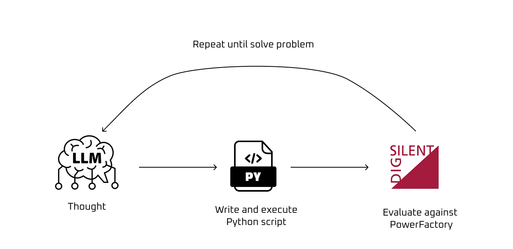
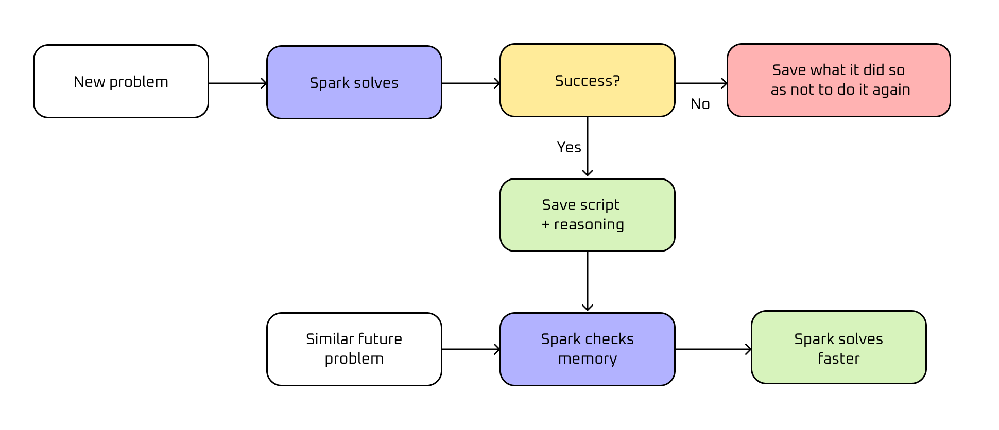

<p align="center">
    
</p>

# Spark

<p>
    
    
    
</p>

Coding agent for DIgSILENT PowerFactory. Takes natural language instructions, writes Python scripts using the PowerFactory API, executes them, and returns structured results.

## Setup

```bash
git clone https://github.com/valdivia-tech/spark.git
cd spark
cp .env.example .env   # set your GOOGLE_API_KEY
uv sync
```

## Usage

```bash
# Single command
uv run spark "run a power flow on BD_2030.pfd"

# Interactive mode
uv run spark -i
```

## Server

```bash
# Start the HTTP server + dashboard
uv run spark-server
```

Opens on `http://localhost:8000` with:
- **Dashboard** — live tasks, activity by day, script execution times, learned experiences
- **REST API** — `POST /tasks`, `GET /tasks`, `GET /sessions`, `GET /script-executions`

## How it works

<p align="center">
    
</p>

Spark is a ReAct agent (Gemini + bash/read/write tools). When you give it an instruction:

1. Writes a Python script
2. Executes it
3. If it fails, fixes and retries
4. Saves results to `workspace/results/*.json`

Each run persists automatically:

| What | Where |
|------|-------|
| Task results | `workspace/results/*.json` |
| Run stats (turns, tokens, cost, duration) | `workspace/results/_last_run_stats.json` |
| Full session history | `workspace/sessions/{session_id}.json` |

## Learning from experience

<p align="center">
    
</p>

Spark learns from both successes and failures, saving experiences to `prompts/learned/` so it can recall them when facing similar problems later.

**On success** — saves a `{slug}.md` file with:
- Learned lessons (non-obvious findings, debugging insights, discovered patterns)
- The complete working Python script

**On failure** — saves a `[FALLIDO] {slug}.md` file with:
- What was tried and the specific errors encountered
- Root cause analysis
- Recommendations for alternative approaches

All experiences are indexed in `prompts/learned/index.md`, which Spark checks at the start of each run to avoid repeating past mistakes and reuse proven solutions.

## Configuration

Set in `.env` or as environment variables:

| Variable | Default | Description |
|----------|---------|-------------|
| `GOOGLE_API_KEY` | — | Required. Google AI API key |
| `GEMINI_MODEL` | `gemini-3.1-flash-lite-preview` | Gemini model to use |
| `MAX_TURNS` | `30` | Max agent turns per run |
| `SPARK_WORKSPACE` | `./workspace` | Working directory for scripts and results |

## Project structure

```
spark/
├── spark.py          # CLI entry point
├── agent.py          # ReAct loop (Gemini + tools)
├── server.py         # FastAPI HTTP server + REST API
├── config.py         # Environment config
├── static/
│   └── index.html    # Dashboard UI
├── prompts/
│   └── system.md     # System prompt with PowerFactory patterns
├── projects/         # PowerFactory .pfd files (Git LFS)
├── workspace/        # Scripts and results (gitignored)
└── .env              # API keys (gitignored)
```
